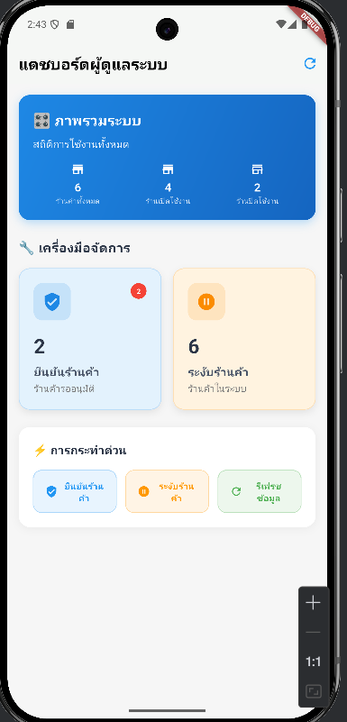
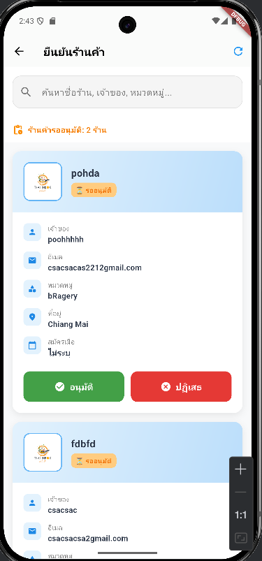
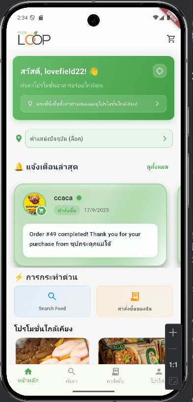
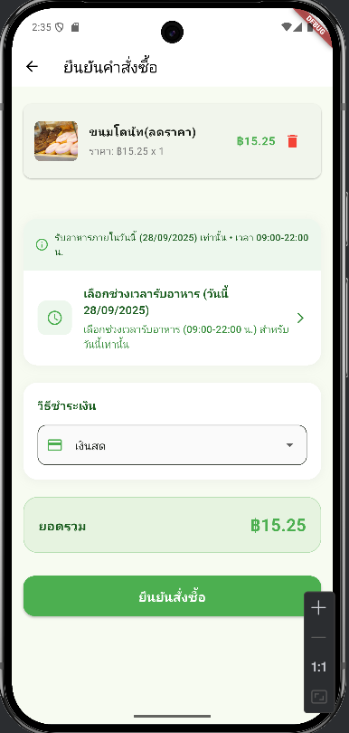
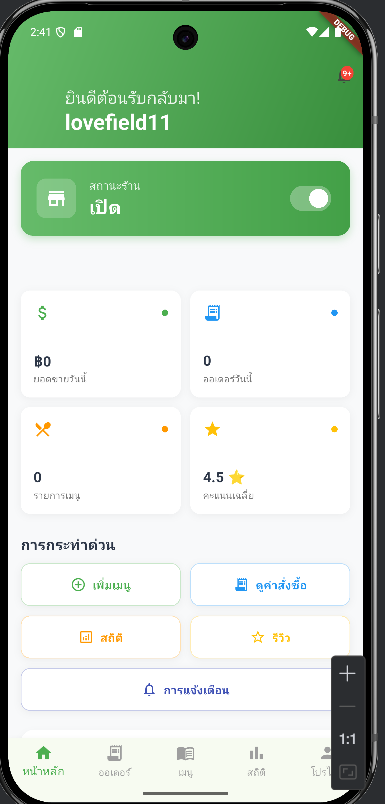
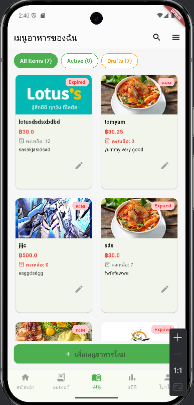
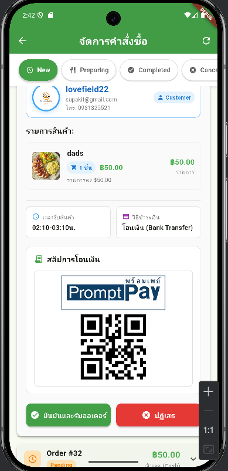
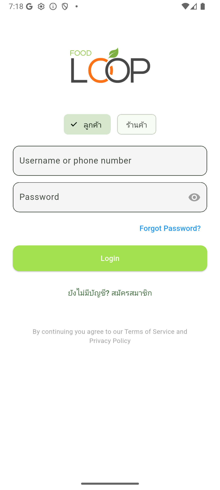

<h1 align="center">Hi 👋, I'm Supakit Chatchawan</h1>
<h3 align="center">🚀 21 y/o | Flutter & Backend Developer | Java Enthusiast</h3>

---

## 👨‍💻 About Me
- 🎓 My name is **ศุภกฤต ชัชวาลย์** (Supakit Chatchawan)  
- 💡 Passionate about creating **real-world solutions** with technology  
- 🚀 Age: 21  
- 🌱 Currently focusing on **Flutter + Spring Boot**

---

## 🛠️ Tech Stack

  
  
  
  
  
  
  
  
  

---

## 🌟 Featured Project

### 🍔 FoodLoop - Food Delivery App
- 📱 Built with **Flutter** (Consumer & Seller UI)  
- 🔗 Backend powered by **Spring Boot & REST API**  
- 🚚 Real-time order management & food delivery system  

  
  
  
  
  
  
  
  

👉 [Check Repository Here](https://github.com/lovefield22/FoodLoop-Flutter-Project)

---

## 📊 GitHub Stats

  
  

---

## 📫 Connect with Me
- ✉️ Email: supakitpooh112233@gmail.com

---

⭐️ From [lovefield22](https://github.com/lovefield22)
